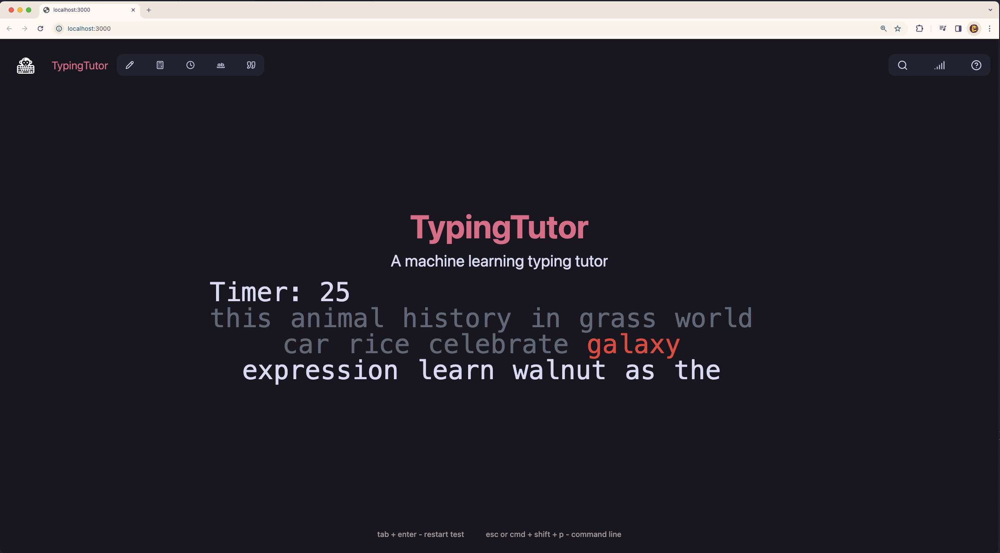

# Typing-ML-Project

  

## Project Description

This project is my first large scale passion project, mixing my experience in web development with my interest in machine learning.  

The project aims to engage the user in a 30-second typing test (inspired by https://monkeytype.com/), gaining metrics on words-per-minute, accuracy, and consistency as they type. The next part I look towards developing is feeding these metrics and keystrokes to a machine-learning algorithm that will recognize patterns in the user’s typing and provide further targeted practice to strengthen their typing habits.  

The project is currently in its early stages, with the typing test being the only feature implemented. I will be polishing up the interface, then the next step is to implement the machine learning model, which will be a challenge as I will be learning as I work on my implementation. Afterwards I will look to deploy to project to a domain so that it can be used as a tool for anyone looking to improve their typing skills.
